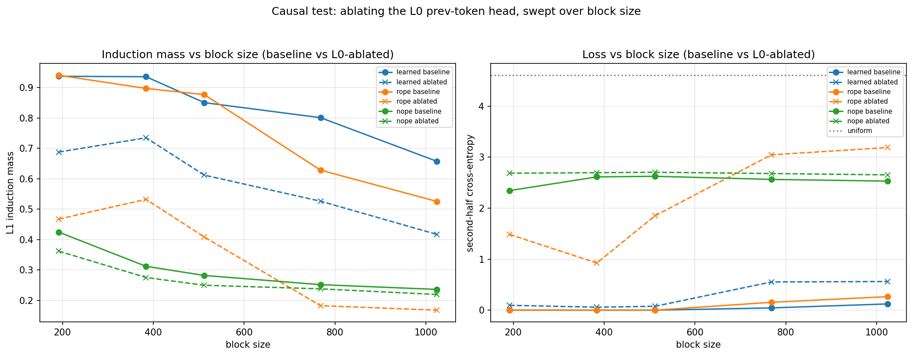
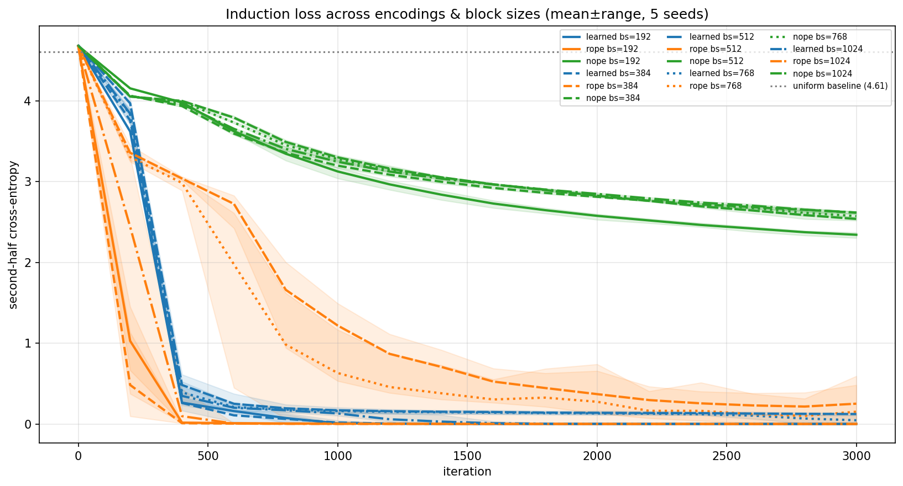
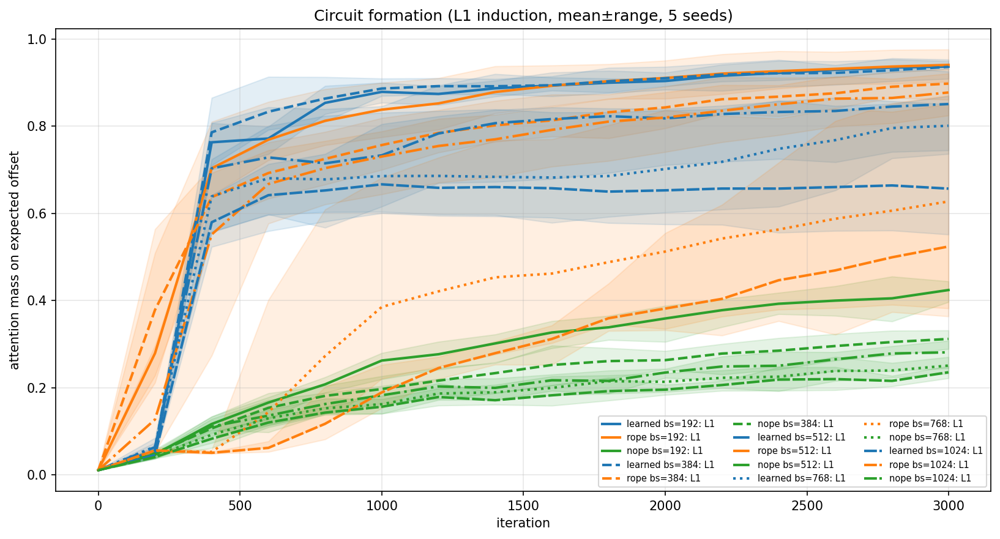
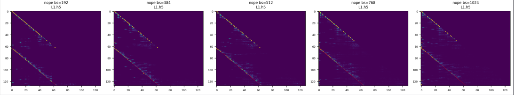

# Pre-registering a positional-encoding ablation study: what I predicted, where I was wrong

A pre-registered mechanistic study of how the choice of positional encodings, namely rotary (**RoPE**), learned (**LPE**), or none (**NoPE**)  shape the formation,
sharpness, and **causal robustness** of induction circuits in a 2-layer
transformer trained on a synthetic copy task. The contribution is
*methodological*: predictions registered before the run, scored honestly
afterward, with misses included. The central phenomenon (RoPE concentrating
positional computation in a single fragile early head) is **not new** — see
[Relation to prior work](#relation-to-prior-work). What this artefact adds is a
*decomposition* of the ablation cost that the prior work does not perform.

**What the run shows.** Ablating the layer-0 previous-token head removes a
*comparable* amount of induction attention mass from RoPE and LPE, but the
*behavioral* cost diverges by an order of magnitude: across every block size,
RoPE's copying collapses when the L0 head is removed while LPE's barely moves.
The mechanism is perturbed about equally; RoPE's *behavior* depends on the single
prev-token head far more than LPE's does. Crucially, I ablate the *upstream*
prev-token head and track attention-mass and behavioral-loss **separately**,
rather than ablating the deposit head and reading one accuracy number, so that the
finding is that the dependence is *behavioral, not mechanical*.

> **Scope, stated up front.** Everything here is a 2-layer, `n_embd=384`,
> 6-head model on a synthetic tiled-repeat task with `vocab_size=100`. These are
> claims about *this regime*, not about RoPE in production-scale LMs. Where the
> toy setting limits the conclusion, I say so rather than extrapolate.

---

## Why this exists

This is my second public research artefact. The goal was not to discover a new
PE scheme but to practice the full loop of mechanistic interpretability work:
form a mechanistic hypothesis, **register predictions before running**, run a
controlled sweep, then score myself honestly against what I predicted, including the misses.

The pre-registration ([`Preregistration.md`](./Preregistration.md)) was committed and
pushed *before* the training run that produced these numbers. I think the misses
below are more interesting than the hits.

---

## Relation to prior work

I found the following after running, not before. This artefact is an independent
toy-model replication with pre-registered predictions; the related work both
pre-empts my headline phenomenon and supplies the mechanism behind two of my
findings. 

- **The deposit pattern (my headline's established neighbor).** Gu et al. (2026,
  *Deconstructing Positional Information*, arXiv:2505.13027) show via head-wise
  causal ablation that RoPE concentrates nearly all shallow-layer positional
  computation into a single early head whose removal is catastrophic, while NoPE and additive PEs show no such concentration, and they prove this "single-head deposit pattern" is intrinsic to RoPE's multiplicative structure. This is the established version of my headline. **The distinction:** they ablate the
  deposit head itself and read a single test-accuracy drop; I ablate the
  *upstream* prev-token head and separate the *mechanical* effect (induction
  attention mass) from the *behavioral* effect (second-half loss). My finding (equal mass removed, unequal behavioral cost) is a decomposition their single-metric ablation does not surface. 

- **Why NoPE's induction is weak (Finding 3).** Barbero et al. (2024, *Round and
  Round We Go*, arXiv:2410.06205) prove (their Prop. 5.2) that a NoPE attention
  head *cannot* construct a sharp diagonal or previous-token pattern, via a counterexample using repeated tokens, which is exactly the regime my probe lives in.
  This is the theoretical backbone for why NoPE forms only a weak induction
  circuit and why ablating its L0 head barely moves anything.

- **Why NoPE recovers *any* position at all (Finding 3).** Position-like signal
  in a decoder-only model can emerge from the causal mask itself: Haviv et al.
  (2022), Kazemnejad et al. (2023), and Zuo et al. (2025, *position information
  emerges via similarity of nearby embeddings*) document this. It explains why
  NoPE's induction mass sits well above the random-init floor rather than at it.

---

## Setup

- **Task.** Each sequence is a randomly-chosen unit of ~64 tokens, tiled to fill
  the block. A model that has learned induction can copy the repeated
  continuation; the second half of the sequence is where copying is possible, so
  **second-half cross-entropy** is the behavioral readout. Uniform baseline is
  `log(100) ≈ 4.61`.
- **Conditions.** 3 encodings × 5 block sizes (`192, 384, 512, 768, 1024`) ×
  5 seeds (`1337, 0, 42, 7, 2024`) = 75 trained models, `max_iters=3000` each.
- **Measurement probe.** A *canonical* induction probe: 64 **distinct** tokens
  repeated exactly once (length 128), identical across every condition, so a
  working induction head produces exactly one clean diagonal at offset 64 rather
  than the moiré of a tiled probe.
- **Causal test.** Identify the L0 previous-token head and the L1 induction head
  per model; zero the L0 head's output and re-measure both induction mass and
  loss. The gap between *mass drop* and *loss increase* is the core of the study.

Two metrics worth distinguishing:
- **L1 stripe / induction mass** — attention weight landing on the correct
  antecedent. *Does the head attend correctly?* (internal)
- **Behavioral induction score** — model's probability of the correct copied
  token. *Does the model output the right thing?* (behavioral)

Full hyperparameters are in [`induction.py`](./induction.py) and `results.json`.

---

## Pre-registered predictions vs. results

| # | Prediction (registered) | Result | Verdict |
|---|---|---|---|
| 1 | Final L1 mass: `RoPE > LPE >> NoPE ≈ 0.1` | RoPE/LPE high; **NoPE = 0.42 → 0.24 across block size, not ≈0.1** | **Miss on NoPE magnitude** |
| 1b | RoPE mass **increases** with block size | RoPE mass **decreases**: 0.94 → 0.90 → 0.88 → 0.63 → 0.52 | **Miss (direction)** |
| 2 | Second-half loss: `NoPE > LPE > RoPE` | Ordering holds (NoPE ≈ 2.3–2.6; LPE & RoPE ≈ 0 until long ctx) | **Hit** |
| 3 | Formation: RoPE fastest, LPE later, NoPE never | RoPE fastest at short ctx; **slows badly at long ctx**; NoPE forms weak circuit, not converged | **Partial** |
| 4/5 | Ablation loss ratio: `RoPE > LPE > NoPE` | Holds decisively (RoPE ratio 12–1200×; LPE 4–44×; NoPE ~1.0×) | **Hit** |
| 6 | Behavioral drop larger for RoPE (~75% conf) | Confirmed — RoPE drop 3–7× LPE's at every block size | **Hit (calibrated)** |
| 6b | RoPE ablated falls **below** LPE ablated (~50%, bold) | Confirmed (means); per-seed separation clean only at bs=1024 | **Hit (with caveat)** |
| 7 | **Similar mass drop, divergent loss** (the headline) | **Confirmed** — see Finding 1 | **Hit** |

Notably, my miss on 1b (I predicted RoPE mass would
*rise* with context) runs the *correct* way once when accounted for the literature:
RoPE's sharpness is expected to degrade over distance, not improve.

---

## Findings

### 1. The dissociation (the headline)
Ablating the L0 prev-token head removes **comparable induction mass** from RoPE
and LPE; RoPE loses 0.36–0.47, LPE loses 0.20–0.28, the same order of magnitude, but the **behavioral cost is not comparable at all**:

| block size | mass drop (RoPE / LPE) | ablated 2nd-half loss (RoPE / LPE) | behav. drop (RoPE / LPE) |
| ---------- | ---------------------- | ---------------------------------- | ------------------------ |
| 192        | 0.47 / 0.25            | **1.49** / 0.10                    | 0.34 / 0.09              |
| 384        | 0.37 / 0.20            | **0.93** / 0.06                    | 0.29 / 0.04              |
| 512        | 0.47 / 0.24            | **1.85** / 0.08                    | 0.49 / 0.05              |
| 768        | 0.45 / 0.28            | **3.05** / 0.55                    | 0.66 / 0.13              |
| 1024       | 0.36 / 0.24            | **3.19** / 0.56                    | 0.54 / 0.11              |

The mechanism is perturbed about equally; RoPE's *behavior* depends on it far
more. Phrased as a ratio, ablation multiplies RoPE's second-half loss by 12–1200×
and LPE's by only 4–44×, but the ratio is unstable because the pre-ablation loss
is near zero, the **absolute** ablated loss (column 3) is the honest statistic,
and there RoPE sits 1–3 nats while LPE stays below 0.6.

This is consistent with (and a finer-grained view of) the deposit pattern of
Gu et al. (2505.13027): if RoPE routes its induction through one specialized
early pathway, removing the prev-token head it feeds on should be behaviorally
catastrophic for RoPE specifically, which is what the loss column shows. The
*equal mass drop* alongside *unequal loss* is the part their single accuracy
metric does not separate.

**Honest caveat on robustness.** The dissociation is decisive *in the mean* at
every block size. Per-seed, the RoPE and LPE ablated-loss distributions fully
separate (every RoPE seed worse than every LPE seed) only at **bs=1024**; at
bs=768 one LPE seed (2024) happens to break under ablation (loss 2.45) and
overlaps the RoPE range. So the claim is "robust in the mean throughout, cleanly
separated per-seed at the longest context, with isolated LPE outlier seeds at
bs=768." It is not "every RoPE seed beats every LPE seed at every block size."



### 2. RoPE's circuit is fragile at long context — in two senses
- **Sharpness:** baseline induction mass falls with block size for RoPE
  (0.94 → 0.52) while LPE stays higher and falls more gently (0.94 → 0.66).
- **Formation:** RoPE at bs=768/1024 forms its circuit *late and unreliably*.
  `circuit_formation.png` shows the long-context RoPE curves rising slowly with
  very wide seed bands (final stripe mass ranges 0.38–0.85 at bs=768), where LPE
  rises fast and tight.

So "RoPE is fragile at long context" is partly a **variance** claim: some RoPE
seeds form a good circuit, some barely do. This is also the post-mortem on
prediction 1b where I predicted mass would *rise* with block size (more tiles → more
to look back to), but the opposite happens. The tiling generator holds repetition
density roughly constant, so "more tiles" was never the right intuition; what
actually varies is the absolute distance the circuit must span, and RoPE's
sharpness degrades over that distance while LPE's degrades more slowly. This
direction is the one the literature would have predicted: Barbero et al.
(2410.06205, Thm 6.1) show RoPE's positional channels lose robustness over long
relative distance which is the scaled-up cousin of the sharpness decay seen here.





### 3. NoPE forms a *weak but real* induction circuit — it is not noise
This contradicts my own prediction. NoPE baseline induction mass is 0.42 → 0.24
across block size which is far above the random-init floor (`≈ 1/128 ≈ 0.008`), and its
**behavioral** score reaches 0.52–0.67 (chance = 0.01). `example_heads.png` shows
a visible, if noisy, offset diagonal in the NoPE row. Its second-half loss is
still *descending* at 3000 iters (2.3–2.6, well below the 4.61 uniform baseline
but not plateaued), so it has not converged.

Tellingly, ablating the L0 head barely touches NoPE (loss ratio ~1.0×, mass drop
< 0.06), its weak induction does not route through a dedicated prev-token head
the way RoPE's and LPE's do.

NoPE cannot build a *sharp* prev-token/diagonal head at all (Barbero et al.
Prop. 5.2 proves this by a repeated-token counterexample), which is exactly why
its induction is weak and why ablating its prev-token head does nothing. Nonetheless, NoPE recovers some position from the causal mask itself (each query attends over a different number of prior tokens), which is why its mass sits above the noise floor rather than at it. 



### 4. A non-monotonic dip in RoPE's ablated loss — checked, and it's noise
RoPE's mean ablated loss is non-monotonic across block size (1.49 → 0.93 → 1.85).
Before reporting this as structure I checked the per-seed values: the bs=192 mean
is inflated by a single seed (loss 4.12 where the others sit 0.23–1.85), and
bs=384 is shaped by two different outlier seeds. The "dip" is seed noise, not a
real trend, so I am **not** claiming it. (Recorded here because checking it was
the point of pre-registering — the prediction file did not anticipate a dip.)

### 5. Measurement validation
The canonical attention induction score and the L1 stripe mass agree to within
0.007 across all conditions (e.g. RoPE bs=1024: 0.525 vs 0.526). They are the
same quantity measured two ways, up to one edge term, so this confirms the
induction-mass measurement is internally consistent rather than an artifact of
one estimator.

---

## Bugs I hit
- **Shared global RNG coupled data to model init.** At a fixed seed the three PE
  modes did *not* train on identical data, as `learned` consumed an extra
  `nn.Embedding` worth of RNG draws before the first batch, offsetting its data
  stream from RoPE/NoPE. Fixed with a dedicated `torch.Generator` for data,
  reseeded per condition, so "same seed" means "identical data, only the PE
  differs." (Same class of bug as my first artefact's batch-order confound.)
- **Tiling probe produced a moiré artifact.** The original probe was a tiled
  repeat, so every second-copy query had many valid antecedents → many faint
  diagonals. Replaced with a single-repeat probe of distinct tokens (one clean
  stripe at offset 64), which makes the induction head legible rather than
  smeared across spurious antecedents.
- **Attributing too much importance to seed noise.** I repeatedly mistook a
  single-seed outlier for a real effect worth explaining (see Finding 4). The fix
  was to always look at the per-seed spread, not just the mean, and to plot
  mean±range so outliers are visible.

---

## What I'd do next (deliberately *not* in this artefact)

- **Linear-probe position from the residual stream**, per layer, for NoPE vs LPE.
  Prediction the causal-mask account makes: position is *not* linearly decodable
  at NoPE's embedding output (token-only by construction), becomes decodable
  after layer 0, and is decodable everywhere for LPE. This would *localize* where
  NoPE's positional signal is born — a natural sequel, not part of this artefact.
- **Push block size further** to find where RoPE's circuit fully fails, and train
  NoPE longer to see whether its still-descending loss plateaus or keeps closing
  the gap.

---

## Reproducing

```bash
python induction.py   # writes figures + results.json to runs/<timestamp>/
```

GPU: RTX 5060, PyTorch 2.11.0 (cu130). Note that TF32 is enabled
(`set_float32_matmul_precision('high')`); combined with CUDA nondeterminism, runs
are not bitwise reproducible. Results are reported as mean±range over 5 seeds,
which is the intended unit of reproducibility.

## Files
- [`Preregistration.md`](./Preregistration.md) — pre-registration, committed before the run
- [`induction.py`](./induction.py) — training + measurement harness
- `runs/<timestamp>/results.json` — all numbers, machine-readable
- `*.png` — the four figures referenced above
