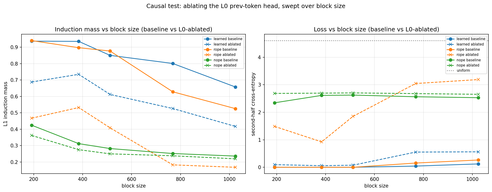
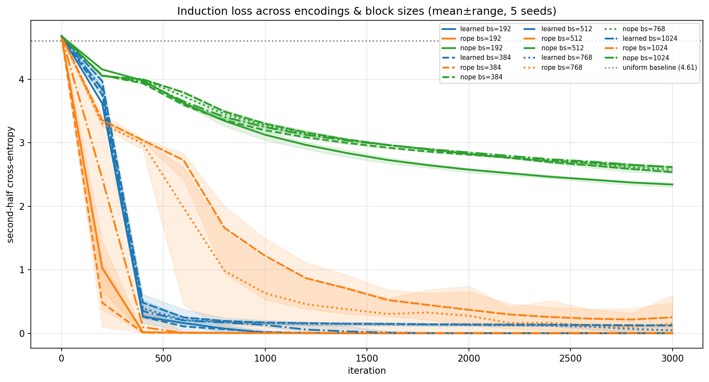
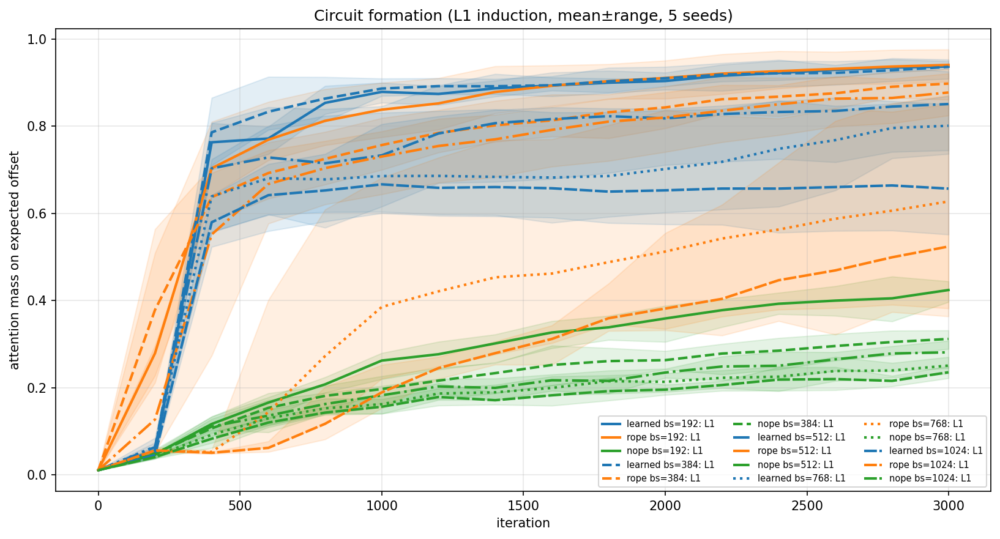
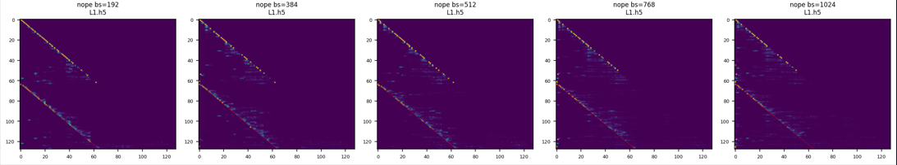

# Pre-registering a positional-encoding ablation study: what I predicted, and where I was wrong

This is a pre-registered mechanistic study of how the choice of positional encoding affects induction circuits in a small transformer. I compare three options: rotary (**RoPE**), learned (**LPE**), and none at all (**NoPE**). For each, I look at how the induction circuit forms, how sharp it gets, and how well it holds up under causal ablation. The model is a 2-layer transformer trained on a synthetic copy task.

The contribution here is mostly *methodological*. I wrote down my predictions before running anything, then scored myself against the results afterward, misses included. The central phenomenon (RoPE concentrating its positional computation in a single, fragile early head) is **not new**; see [Relation to prior work](#relation-to-prior-work). What this project adds is a *decomposition* of the ablation cost that the earlier work doesn't do.

**What the run shows.** When I ablate the layer-0 previous-token head, RoPE and LPE lose a *comparable* amount of induction attention mass. But the *behavioral* cost differs by roughly an order of magnitude. At every block size, RoPE's copying falls apart once the L0 head is gone, while LPE's barely changes. In other words, the mechanism takes a similar hit in both cases, but RoPE's behavior leans on that single previous-token head much more heavily than LPE's does.

The key design choice is *where* I ablate and *what* I measure. Instead of removing the deposit head and reading off a single accuracy number, I remove the *upstream* previous-token head and track attention mass and behavioral loss **separately**. That separation is what lets me say the dependence is *behavioral rather than mechanical*.

> **Scope.** Everything here comes from a 2-layer, 6-head model with `n_embd=384`, trained on a synthetic tiled-repeat task with `vocab_size=100`. These are claims about *this setting*, not about RoPE in production-scale language models. Wherever the toy setup limits what I can conclude, I say so instead of extrapolating.

---

## Why I did this

This is my second public research project. I wasn't trying to invent a new positional encoding. I wanted to practice the full loop of mechanistic interpretability work: come up with a mechanistic hypothesis, **commit to predictions before running**, run a controlled sweep, and then grade myself honestly against what I said would happen.

The pre-registration ([`Preregistration.md`](./Preregistration.md)) was committed and pushed *before* the training run that produced these numbers. Honestly, I find the misses more interesting than the hits.

---

## Relation to prior work

I came across the following papers after running the experiments, not before. So this project is best read as an independent toy-model replication with pre-registered predictions. The prior work both anticipates my headline result and explains the mechanism behind two of my other findings.

- **The deposit pattern (the established version of my headline).** Gu et al. (2026, *Deconstructing Positional Information*, arXiv:2505.13027) use head-wise causal ablation to show that RoPE packs nearly all of its shallow-layer positional computation into a single early head, and that removing that head is catastrophic. NoPE and additive positional encodings don't show this concentration. They also prove that this "single-head deposit pattern" follows directly from RoPE's multiplicative structure. **How my work differs:** they ablate the deposit head itself and measure one drop in test accuracy. I ablate the *upstream* previous-token head and separate the *mechanical* effect (induction attention mass) from the *behavioral* effect (second-half loss). My finding, similar mass removed but very different behavioral cost, is a split that a single-metric ablation can't show.

- **Why NoPE's induction is weak (Finding 3).** Barbero et al. (2024, *Round and Round We Go*, arXiv:2410.06205) prove (Prop. 5.2) that a NoPE attention head *cannot* build a sharp diagonal or previous-token pattern. Their counterexample uses repeated tokens, which is exactly the regime my probe operates in. This gives a theoretical explanation for why NoPE only forms a weak induction circuit, and why ablating its L0 head changes almost nothing.

- **Why NoPE recovers *any* position at all (Finding 3).** In a decoder-only model, position-like information can emerge from the causal mask alone. Haviv et al. (2022), Kazemnejad et al. (2023), and Zuo et al. (2025, who show that *position information emerges via similarity of nearby embeddings*) all document this. It explains why NoPE's induction mass sits well above the random-init floor instead of right at it.

---

## Setup

- **Task.** Each sequence is a randomly chosen unit of about 64 tokens, tiled to fill the block. A model that has learned induction can copy the repeated continuation. Copying is only possible in the second half of the sequence, so **second-half cross-entropy** is the behavioral measure. The uniform baseline is `log(100) ≈ 4.61`.
- **Conditions.** 3 encodings × 5 block sizes (`192, 384, 512, 768, 1024`) × 5 seeds (`1337, 0, 42, 7, 2024`) = 75 trained models, each trained for `max_iters=3000`.
- **Measurement probe.** I use a *canonical* induction probe: 64 **distinct** tokens repeated exactly once (length 128), identical across all conditions. A working induction head produces one clean diagonal at offset 64, instead of the moiré pattern you get from a tiled probe.
- **Causal test.** For each model, I identify the L0 previous-token head and the L1 induction head, zero out the L0 head's output, and then re-measure both induction mass and loss. The gap between the *drop in mass* and the *increase in loss* is the core of the study.

Two metrics are worth keeping apart:
- **L1 stripe / induction mass**: how much attention weight lands on the correct earlier token. This answers *does the head attend to the right place?* (internal)
- **Behavioral induction score**: the probability the model assigns to the correct copied token. This answers *does the model actually output the right thing?* (behavioral)

Full hyperparameters are in [`induction.py`](./induction.py) and `results.json`.

---

## Pre-registered predictions vs. results

| # | Prediction (registered) | Result | Verdict |
|---|---|---|---|
| 1 | Final L1 mass: `RoPE > LPE >> NoPE ≈ 0.1` | RoPE/LPE high; **NoPE = 0.42 → 0.24 across block sizes, not ≈ 0.1** | **Miss on NoPE magnitude** |
| 1b | RoPE mass **increases** with block size | RoPE mass **decreases**: 0.94 → 0.90 → 0.88 → 0.63 → 0.52 | **Miss (wrong direction)** |
| 2 | Second-half loss: `NoPE > LPE > RoPE` | Ordering holds (NoPE ≈ 2.3–2.6; LPE and RoPE ≈ 0 until long context) | **Hit** |
| 3 | Formation: RoPE fastest, LPE later, NoPE never | RoPE is fastest at short context but **slows down badly at long context**; NoPE forms a weak circuit and hasn't converged | **Partial** |
| 4/5 | Ablation loss ratio: `RoPE > LPE > NoPE` | Holds clearly (RoPE ratio 12–1200×; LPE 4–44×; NoPE ~1.0×) | **Hit** |
| 6 | Behavioral drop larger for RoPE (~75% confidence) | Confirmed: RoPE's drop is 3–7× LPE's at every block size | **Hit (well calibrated)** |
| 6b | RoPE ablated ends up **below** LPE ablated (~50%, a bold call) | Confirmed in the means; per-seed separation is clean only at bs=1024 | **Hit (with caveat)** |
| 7 | **Similar mass drop, different loss** (the headline) | **Confirmed**, see Finding 1 | **Hit** |

One note on miss 1b: I predicted RoPE's mass would *rise* with context length. It fell. Looking at the literature afterward, falling is what I should have expected, since RoPE's sharpness is known to degrade over distance.

---

## Findings

### 1. The dissociation (the headline)
Ablating the L0 previous-token head removes a **comparable amount of induction mass** from RoPE and LPE. RoPE loses 0.36–0.47 and LPE loses 0.20–0.28, so they're in the same ballpark. The **behavioral cost**, though, is in a completely different league:

| block size | mass drop (RoPE / LPE) | ablated 2nd-half loss (RoPE / LPE) | behav. drop (RoPE / LPE) |
| ---------- | ---------------------- | ---------------------------------- | ------------------------ |
| 192        | 0.47 / 0.25            | **1.49** / 0.10                    | 0.34 / 0.09              |
| 384        | 0.37 / 0.20            | **0.93** / 0.06                    | 0.29 / 0.04              |
| 512        | 0.47 / 0.24            | **1.85** / 0.08                    | 0.49 / 0.05              |
| 768        | 0.45 / 0.28            | **3.05** / 0.55                    | 0.66 / 0.13              |
| 1024       | 0.36 / 0.24            | **3.19** / 0.56                    | 0.54 / 0.11              |

The mechanism gets disrupted by a similar amount in both, but RoPE's *behavior* depends on it far more. As a ratio, ablation multiplies RoPE's second-half loss by 12–1200× and LPE's by only 4–44×. I wouldn't lean on those ratios too much, though: the pre-ablation loss is close to zero, which makes them unstable. The **absolute** ablated loss (third column) is the more honest number, and there RoPE sits at 1–3 nats while LPE stays below 0.6.

This fits with, and adds detail to, the deposit pattern from Gu et al. (2505.13027). If RoPE routes its induction through one specialized early pathway, then removing the previous-token head that feeds it should hit RoPE's behavior especially hard, and that's what the loss column shows. The part their single accuracy metric doesn't pull apart is the combination of *similar mass drop* and *very different loss*.

**A caveat on robustness.** The dissociation is clear *in the mean* at every block size. Looking at individual seeds, though, the RoPE and LPE ablated-loss distributions only fully separate (every RoPE seed worse than every LPE seed) at **bs=1024**. At bs=768, one LPE seed (2024) happens to break under ablation (loss 2.45) and lands inside the RoPE range. So the accurate claim is: the effect is robust in the mean everywhere, cleanly separated per seed at the longest context, with the occasional LPE outlier at bs=768. It is *not* "every RoPE seed is worse than every LPE seed at every block size."



### 2. RoPE's circuit is fragile at long context, in two ways
- **Sharpness:** RoPE's baseline induction mass drops with block size (0.94 → 0.52). LPE starts at the same level and declines more gently (0.94 → 0.66).
- **Formation:** At bs=768 and 1024, RoPE forms its circuit *late and inconsistently*. In `circuit_formation.png`, the long-context RoPE curves climb slowly and have very wide seed bands (final stripe mass ranges from 0.38 to 0.85 at bs=768), while LPE climbs quickly and consistently.

So "RoPE is fragile at long context" is partly a claim about **variance**: some RoPE seeds build a good circuit and some barely manage it.

This is also where prediction 1b went wrong. I expected mass to *rise* with block size, reasoning that more tiles would give the model more to look back at. The opposite happened. The tiling generator keeps repetition density roughly constant, so "more tiles" was never the right way to think about it. What actually changes is the absolute distance the circuit has to span, and RoPE's sharpness degrades over that distance faster than LPE's does. This is the direction the literature would have predicted: Barbero et al. (2410.06205, Thm 6.1) show that RoPE's positional channels become less robust over long relative distances, which is a larger-scale version of the sharpness decay I see here.





### 3. NoPE forms a weak but real induction circuit, not just noise
This one contradicts my own prediction. NoPE's baseline induction mass goes from 0.42 to 0.24 across block sizes, far above the random-init floor (`≈ 1/128 ≈ 0.008`). Its **behavioral** score reaches 0.52–0.67, against a chance level of 0.01. In `example_heads.png` you can see a visible, if noisy, offset diagonal in the NoPE row. Its second-half loss is still *going down* at 3000 iterations (2.3–2.6, well under the 4.61 uniform baseline but not yet flat), so it hasn't converged.

Interestingly, ablating the L0 head hardly affects NoPE at all (loss ratio ~1.0×, mass drop under 0.06). Its weak induction doesn't run through a dedicated previous-token head the way RoPE's and LPE's does.

That lines up with theory. NoPE can't build a *sharp* previous-token or diagonal head in the first place (Barbero et al. prove this in Prop. 5.2 with a repeated-token counterexample), which explains both why its induction is weak and why removing its previous-token head does nothing. Still, NoPE does recover some positional information from the causal mask itself, because each query attends over a different number of earlier tokens. That's why its mass sits above the noise floor rather than at it.



### 4. A dip in RoPE's ablated loss: I checked, and it's noise
RoPE's mean ablated loss doesn't change monotonically with block size (1.49 → 0.93 → 1.85). Before treating that as real structure, I looked at the per-seed values. The bs=192 mean is pulled up by a single seed (loss 4.12, while the others sit between 0.23 and 1.85), and the bs=384 mean is shaped by two other outlier seeds. The "dip" is seed noise, not a trend, so I'm **not** making any claim about it. I'm including it anyway because catching things like this is the whole point of pre-registering, and my prediction file didn't anticipate a dip.

### 5. Checking the measurement
The canonical attention induction score and the L1 stripe mass agree to within 0.007 across all conditions (for example, RoPE at bs=1024: 0.525 vs 0.526). They're the same quantity measured two different ways, apart from one edge term, so this agreement suggests the induction-mass measurement is consistent and not an artifact of one particular estimator.

---

## Bugs I ran into
- **A shared global RNG tied the data to model initialization.** At a fixed seed, the three PE modes were *not* actually training on the same data. The `learned` mode used up an extra `nn.Embedding`'s worth of random draws before the first batch, which shifted its data stream relative to RoPE and NoPE. I fixed this by giving data generation its own `torch.Generator`, reseeded for each condition, so that "same seed" now really means "same data, only the PE differs." (This is the same kind of bug as the batch-order confound in my first project.)
- **The tiled probe created a moiré artifact.** My original probe was a tiled repeat, so every query in the second copy had many valid earlier matches, which showed up as lots of faint diagonals. I replaced it with a single-repeat probe of distinct tokens, which gives one clean stripe at offset 64 and makes the induction head actually readable.
- **Reading too much into seed noise.** More than once, I mistook a single outlier seed for a real effect that needed explaining (see Finding 4). The fix was to always look at the per-seed spread and not just the mean, and to plot mean ± range so outliers are easy to spot.

---

## What I'd do next (intentionally left out of this project)

- **Linearly probe position from the residual stream**, layer by layer, for NoPE versus LPE. The causal-mask explanation makes a specific prediction: position should *not* be linearly decodable at NoPE's embedding output (which contains token information only, by construction), should become decodable after layer 0, and should be decodable everywhere for LPE. This would pin down *where* NoPE's positional signal first appears. It's a natural follow-up, but outside the scope of this project.
- **Push block size further** to find the point where RoPE's circuit fails completely, and **train NoPE longer** to see whether its still-falling loss levels off or keeps closing the gap.

---

## Reproducing

```bash
python induction.py   # writes figures + results.json to runs/<timestamp>/
```

GPU: RTX 5060, PyTorch 2.11.0 (cu130). TF32 is enabled (`set_float32_matmul_precision('high')`), and combined with CUDA nondeterminism this means runs aren't bitwise reproducible. All results are reported as mean ± range over 5 seeds, which is the intended unit of reproducibility.

## Files
- [`Preregistration.md`](./Preregistration.md): the pre-registration, committed before the run
- [`induction.py`](./induction.py): training and measurement code
- `runs/<timestamp>/results.json`: all the numbers, in machine-readable form
- `*.png`: the four figures referenced above
